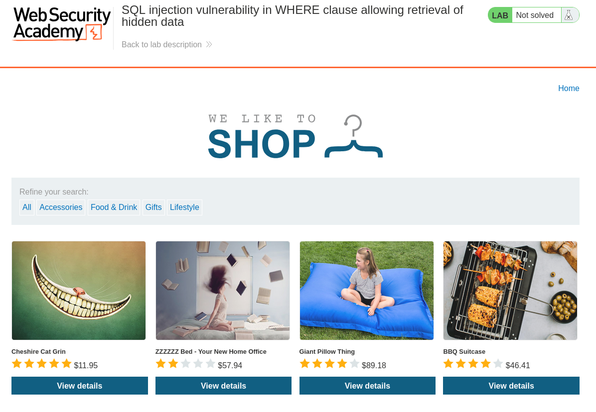
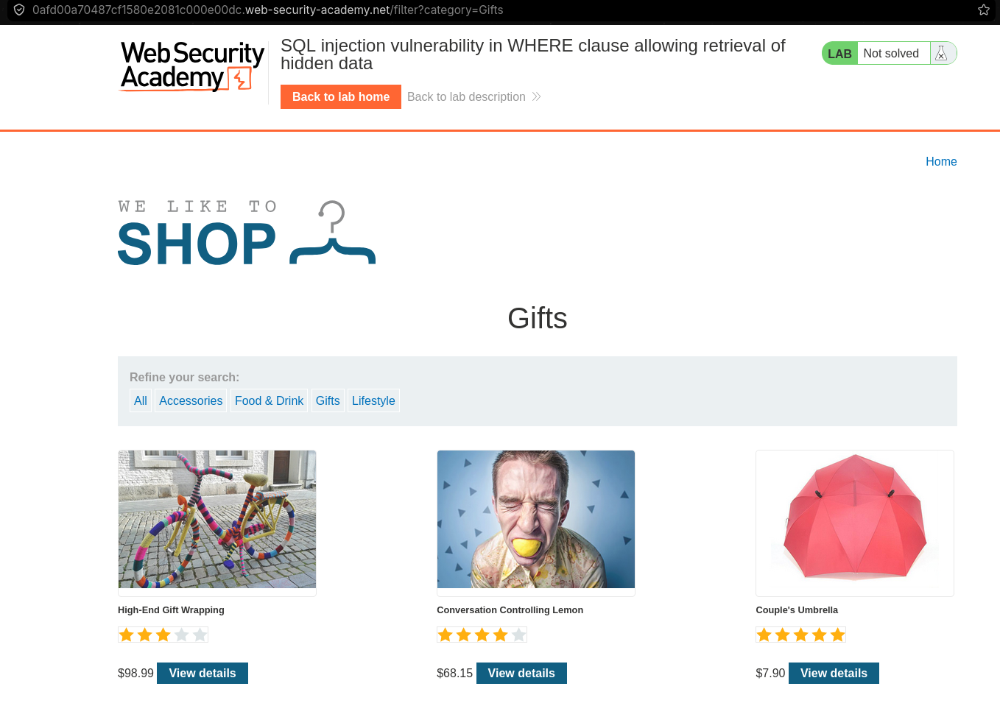
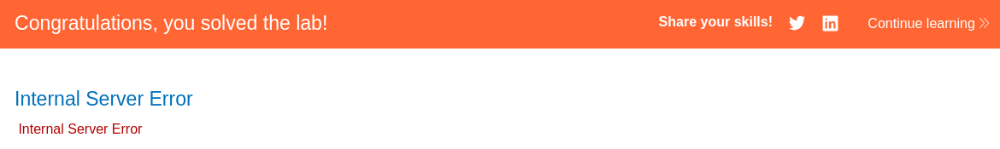
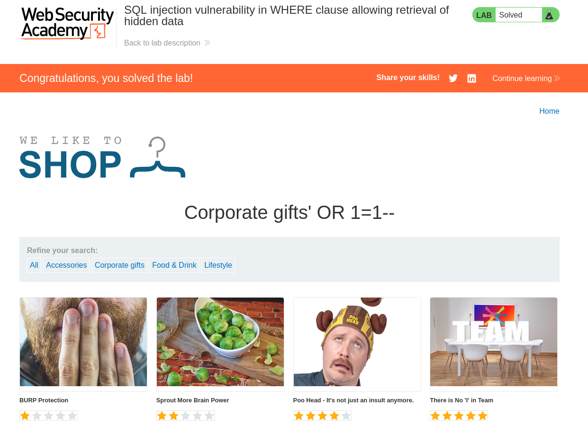

# 1.Резюме

В ходе тестирования веб-приложения `https://lab-target.web-security-academy.net` была обнаружена **SQL-инъекция (SQLi)** в фильтре категорий товаров.

**Тип уязвимости**: `WHERE clause` — некорректная конкатенация пользовательского ввода в SQL-запрос.

**Воздействие**: Злоумышленник может модифицировать логику запроса и получить данные, которые не должны отображаться (включая скрытые, неопубликованные или тестовые товары).

**Результат**: Все скрытые товары (например, `"Gift Card — Secret Edition"`) успешно извлечены без авторизации.

---

# 2. Разведка (Reconnaissance)

## 2.1. Изучение целевого приложения

При переходе на главную страницу отображается каталог товаров с фильтром по категориям (например, `Gifts`, `Pets`, `Clothing`).
*Рисунок 1 — Интерфейс магазина с фильтром категорий*:


При клике на категорию `Gifts` URL изменяется на: https://lab-target.web-security-academy.net/filter?category=Gifts
*Рисунок 2 — Интерфейс магазина с применённым фильтром категорий 'Gifts'*:


## 2.2. Гипотеза (предполагаемый SQL-запрос)

Скорее всего, бэкенд выполняет примерно такой запрос:

```sql
SELECT * FROM products WHERE category = 'Gifts' AND released = 1
```
Где `released = 1` — фильтр, показывающий только опубликованные товары.

# 3. Поиск уязвимости (Vulnerability Discovery)
## 3.1. Тестирование с одинарной кавычкой

Подставим значение Gifts' в параметр category: https://lab-target.web-security-academy.net/filter?category=Gifts'

Результат — ошибка базы данных: `HTTP 500 Internal Server Error`
*Рисунок 3 - Ошибка 500*

Поскольку ошибка именно 500, это значит, что сервер попытался выполнить SQL запрос, но из-за ошибки в синтаксисе выдал ошибку. Если бы присутсвовало экранирование, он бы выполнил запрос и вернул 200 OK. Можно сделать вывод, что пользовательский ввод попадает в запрос без экранирования. SQL-инъекция подтверждена. 
## 3.2 Подтверждение и реализация SQLi
В соответсвии с заданием, нам нужно, чтобы сервер выдал товары, которые ещё не выпущенные, т.е. `released = 0`. Попробуем закоментировать это условие и добавить новое, которое всегда возвращает истину. Например `' OR 1=1 --`. Здесь `'` - закрывает первый запрос, `OR 1=1` - всегда возвращает истину, `--` - коментирует всё, что идет дальше. Т.е. в конечном итоге получается следующий SQL запрос:
```sql
SELECT * FROM products WHERE category = 'Gifts'' OR 1=1 --AND released = 1
```
В итоге все условия в WHERE игнорируются, кроме OR 1=1, поскольку оно всегда истино, мы получим все товары, по итоге сервер выполнит данный запрос: 

```sql
SELECT * FROM products
```

Финальный URL: https://lab-target.web-security-academy.net/filter?category=Gifts'+OR+1=1+--
*Рисунок 4 - Результат SQLi*


# 4 Выводы
- Уязвимость найдена в параметре category приложения.
- **Вектор атаки:** изменение логики WHERE clause через вставку ' OR 1=1 --.
- **Последствия:** disclosure (раскрытие) неопубликованных товаров — в реальном сценарии это могут быть цены, промокоды или информация о новинках до релиза.

Лабораторная работа **выполнена**. Уязвимость подтверждена, скрытые данные извлечены.

