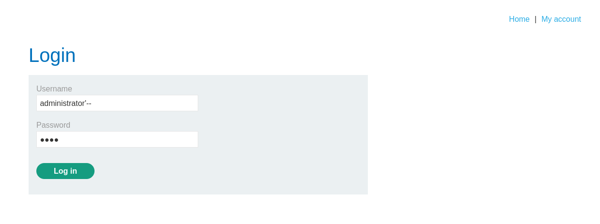
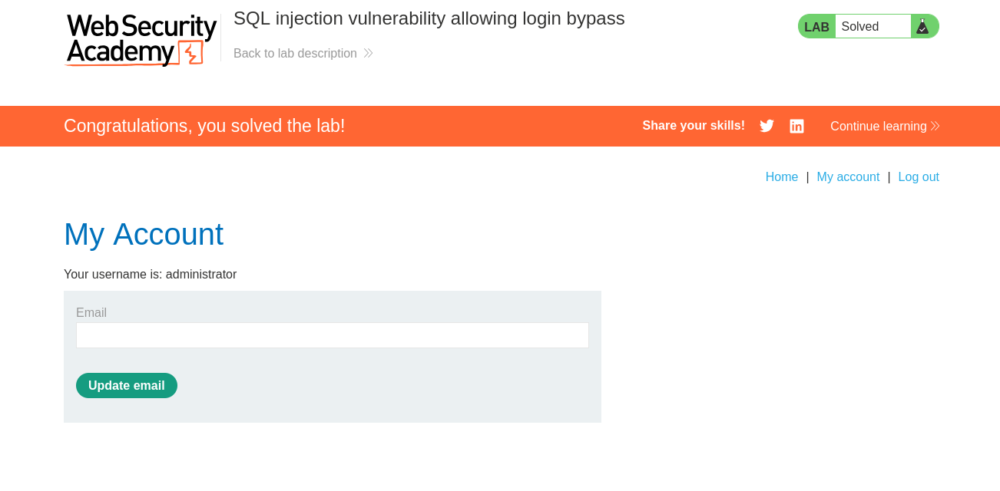

# 1.Резюме

В ходе тестирования веб-приложения `https://lab-target.web-security-academy.net` была обнаружена **SQL-инъекция (SQLi)** в форме входа на сайт. Бэкенд-приложение некорректно обрабатывает вводимые пользователем данные в поле username, что позволяет злоумышленнику модифицировать структуру SQL-запроса.

**Тип уязвимости**: `WHERE clause` — некорректная конкатенация пользовательского ввода в SQL-запрос.

**Воздействие**: Злоумышленник может обойти проверку пароля и получить доступ к аккаунту администратора.

**Результат**: Успешный вход в систему под пользователем `administrator` без знания пароля.

---

# 2.Поиск и реализация уязвимости

По условию лабораторной работы, сервер небезопасно обрабатывает ввод пользователя в форме login. Поэтому можно сразу попробовать ввести логин administrator и добавить `'--`, чтобы завершить ввод и закоментировать все остальные поля. В итоге запрос к базе данных будет следующим:
```sql
SELECT * FROM users WHERE username = 'administrator'--' AND password = ''
```
И в итоге, всё будет игнорироваться, кроме наличия самой учетной записи администратора, не нужны ни пароли,ни другие средства аутентификации, потому что всё закоментировано, а сам запрос по сути заканчивается на поле `username = 'administrator'`.
*Рисунок 1 - Попытка SQLi*


И результатом наших действий стал вход под пользователем administrator. Теперь можно делать всё от его имени(удалять пользователей, создавать новых и т.д., смотря, что ему разрешено).
*Рисунок 2 - Результат SQLi*


# 3.Выводы
- Уязвимость найдена в форме входа.
- **Вектор атаки:** изменение логики WHERE clause через вставку '--.
- **Последствия:** несанкционированный доступ к УЗ администратора и можно действовать от его имени.

Лабораторная работа **выполнена**. Уязвимость подтверждена, успешная попытка входа(администратором) от злоумышленника.
