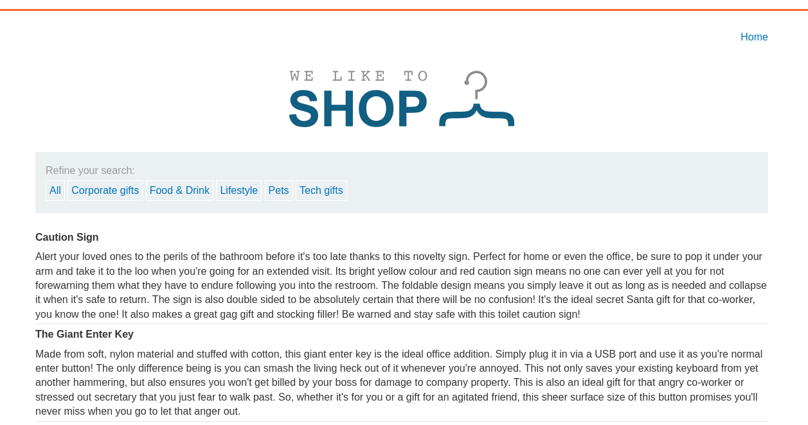
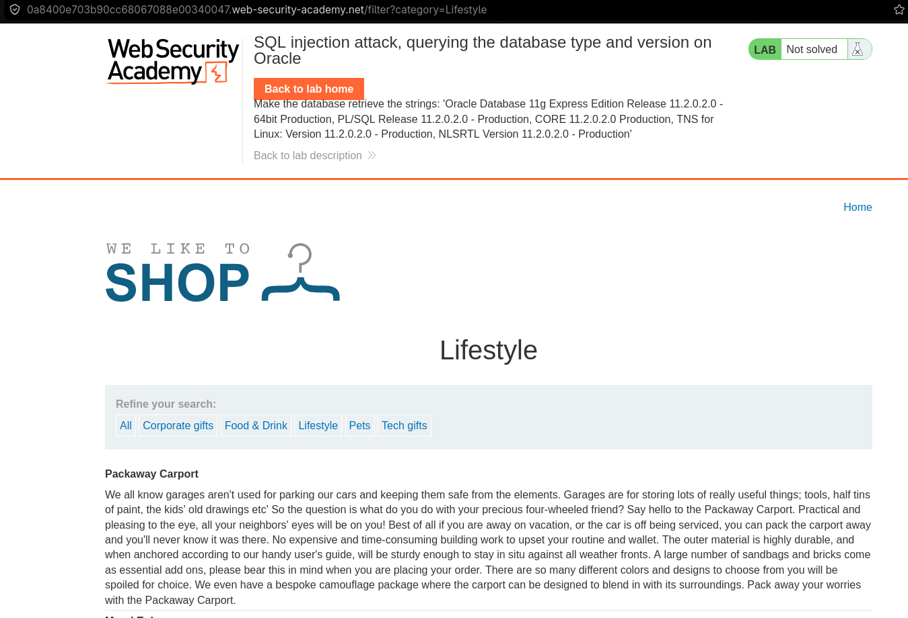
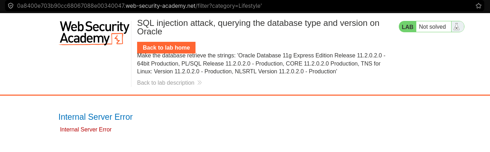
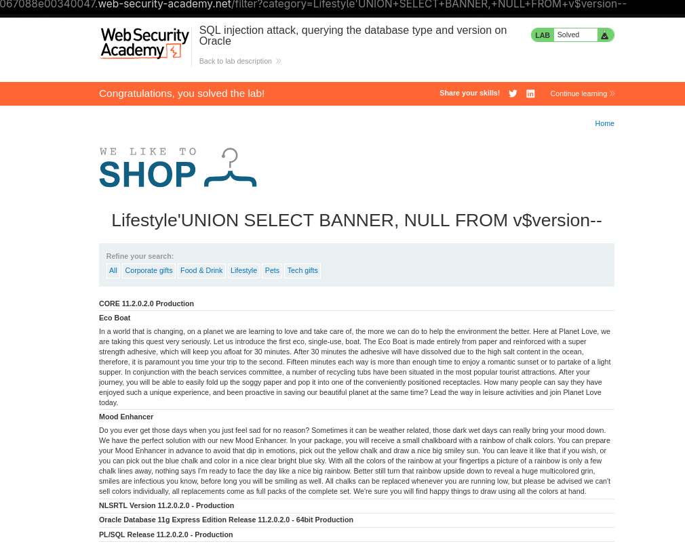

# 1.Резюме

В ходе тестирования веб-приложения `https://lab-target.web-security-academy.net` была обнаружена **SQL-инъекция (SQLi)** в фильтре категорий товаров.

**Тип уязвимости**: Некорректная конкатенация пользовательского ввода в SQL-запрос.

**Воздействие**: Злоумышленник может модифицировать логику запроса и получить данные, которые не должны отображаться (включая скрытые, неопубликованные или тестовые товары).

**Результат**: По условию задания с помощью `UNION SELECT` нужно получить версию Базы Данных.

---

# 2.Разведка

На главной страницы сайта можно найти фильтр товаров, и если выбрать категорию, то URL меняется(к нему добавляется соответствующая переменная category=''). 
*Рисунок 1 — Интерфейс магазина с фильтром категорий*:

Например, если мы выберем категорию Lifestyle, то URL изменится на следующий: https://lab-target.web-security-academy.net/filter?category=Lifestyle.
*Рисунок 2 — Применение фильтра*:

Выглядит как потенциальная SQLi уязвимость. можно попрововать добавить `'` в конец, и если будет ошибки, то вполне вероятно, что сервер не проверяет и не санитизиурет ввод пользователя, тем самым, ковычка, которую мы добавили сломала весь запрос к базе данных. Как и следовало ожидать, после махинаций с URL получаем ошибку 500.
*Рисунок 3 — Error 500*:

# 3.Тестирование уязвимости
По условию задачи, нам нужно получить в ответе на запрос к базе данных её версию. Это можно сделать с помощью объединения двух запросов в один с помощью `UNION`. Кроме того в самой лабораторной есть подсказка, что БД - Oracle. А синатксис для получения версии: `SELECT * FROM v$version`. Уже можно было бы начать действовать, но есть одно важное условие в работе `UNION` - количество столбцов первого и второго запроса должны быть равны, и их должно быть столько, сколько у левого запроса, кроме того, тип данных должен быть схож. Если посмотреть на ответы после фильтра, можно заметить, что показывается заголовок и тело товара, поэтому можно начать с двух столбцов для второго запроса, второй будет Null, так как нам нужно только версия БД. В конечном счёте URL запрос следующий:
`https://lab-target.web-security-academy.net/filter?category=Lifestyle'UNION+SELECT+BANNER,+NULL+FROM+v$version--`
Результат:
*Рисунок 3 — SQLi*:

# 4 Выводы
- Уязвимость найдена в параметре category приложения.
- **Вектор атаки:** изменение логики sql запроса с помощью `UNION`.
- **Последствия:** получение версии БД.

Лабораторная работа **выполнена**. Уязвимость подтверждена, скрытые данные извлечены.
