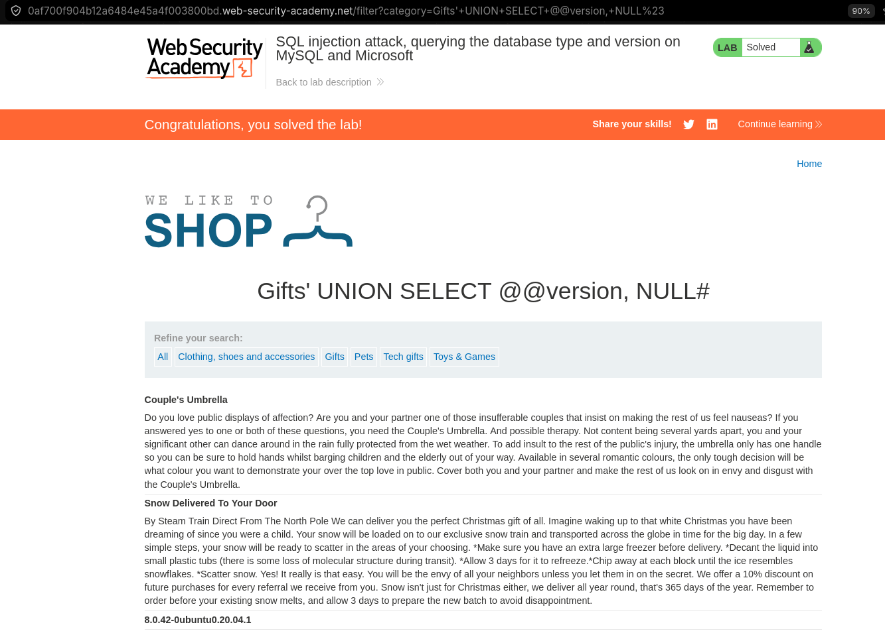

# 1.Резюме

По своей сути точно такая же как лабораторная 3, отличия только в синтаксисе запроса и в этой лабе сервер ругается на отсутсвие url encoding. Поэтому рассмотрим только их.

В ходе тестирования веб-приложения `https://lab-target.web-security-academy.net` была обнаружена **SQL-инъекция (SQLi)** в фильтре категорий товаров.

**Тип уязвимости**: Некорректная конкатенация пользовательского ввода в SQL-запрос.

**Воздействие**: Злоумышленник может модифицировать логику запроса и получить данные, которые не должны отображаться (включая скрытые, неопубликованные или тестовые товары).

**Результат**: По условию задания с помощью `UNION SELECT` нужно получить версию Базы Данных.

---

# 2.Тестирование уязвимости

Лаба подскаывает, что БД - MySql. Поэтому итоговый запрос с инъекцией будет выглядить так без кодировки:
`https://lab-target.web-security-academy.net/filter?category=Gifts'+UNION+SELECT+@@version,+NULL#`
Так же как и в лабораторно 3 у нас в левом запросе два столбца, поэтому помимо версии БД, мы запрашиваем пустой столбец и в конце добавляем комментарий, но уже в синаткисе mysql.

И остается только url кодировка. Поскольку символ `#` браузер считает особенным и будет искать его на самой странице, что нам не нужно, мы хотим, чтобы он всё отправил серверу, поэтому нам нужно закодировать символ через url-encoding, т.е. `#` станет `%23`. Итоговый запрос:
*Рисунок 1 - SQLi запрос*

# 3 Выводы
- Уязвимость найдена в параметре category приложения.
- **Вектор атаки:** изменение логики sql запроса с помощью `UNION`.
- **Последствия:** получение версии БД.

Лабораторная работа **выполнена**. Уязвимость подтверждена, скрытые данные извлечены.
