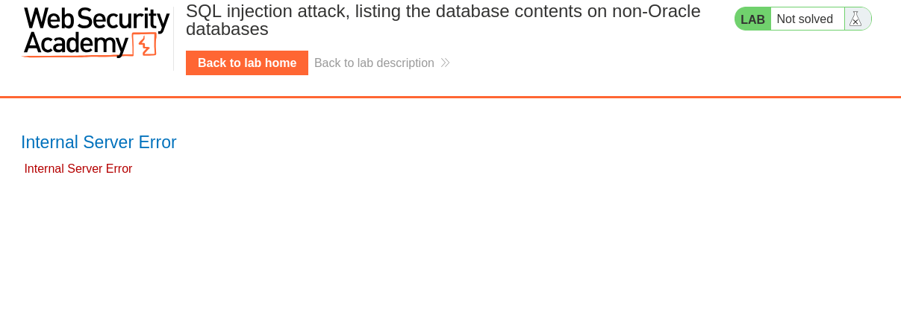
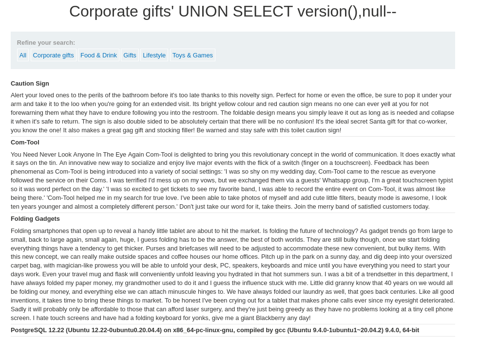
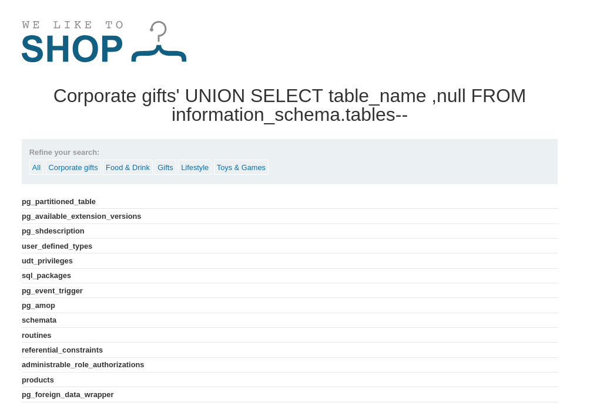
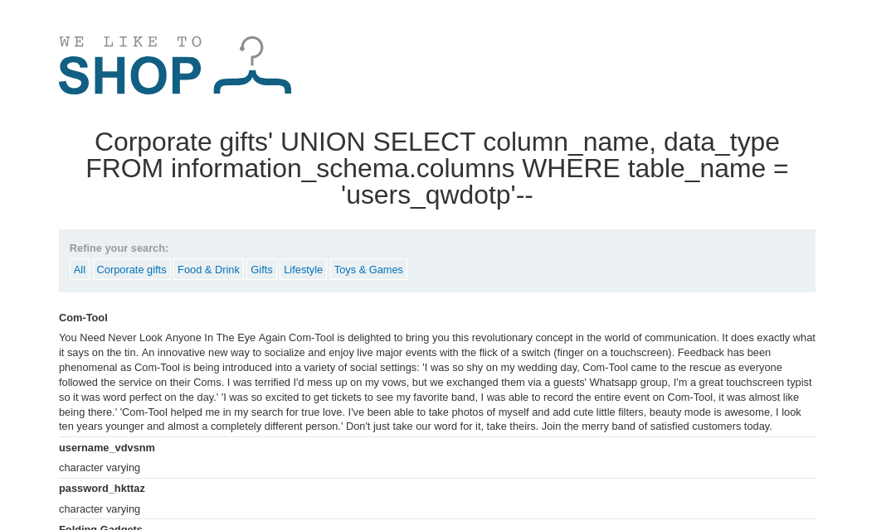
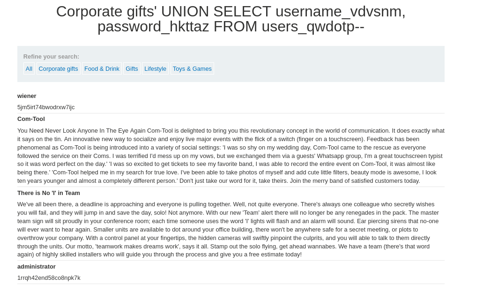
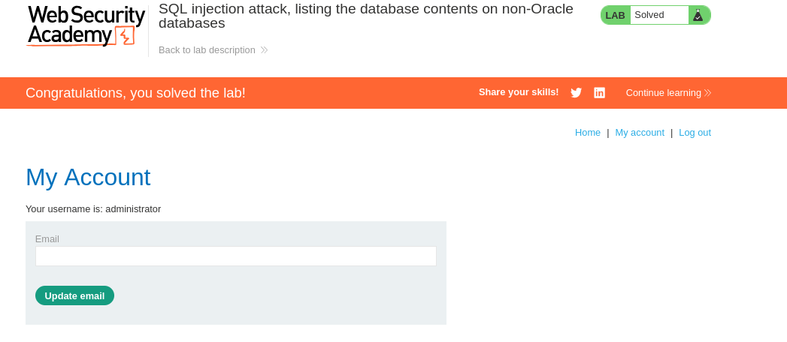

# 1.Резюме
Вот тут уже поинтересней, здесь хотя бы реально пришлось получить доступ к паролю администратора, а не как в предыдущих, только версию БД.

В ходе тестирования веб-приложения `https://lab-target.web-security-academy.net` была обнаружена **SQL-инъекция (SQLi)** в фильтре категорий товаров.

**Тип уязвимости**: Некорректная конкатенация пользовательского ввода в SQL-запрос.

**Воздействие**: Злоумышленник может модифицировать логику запроса и получить данные, которые не должны отображаться(включая логин и пароль администратора).

**Результат**: По условию задания с помощью `UNION SELECT` нужно получить пароль администратора и войти под соответствующей УЗ.

# 2.Поиск уязвимости
Главная страница сайта аналогично предыдущим лабораторным, поэтому проверяем наличие уязвимости, вставляя в строку url после фильтра символ `'` чтобы сломать запрос и получить ошибку 500. 
Итоговый url:`https://lab-target.web-security-academy.net/filter?category=Accessories'`. И нужная ошибка.
*Рисунок 1 - Ошибка 500*

Теперь можно попробовать узнать тип и версию БД, прежде чем разбиратся в внутренними таблицами. По условию задания есть подсказка, что остаётся только PostgreSQl. Тогда с помощью `UNION` попробуем вытащит версию БД, учитывая, что в левом запросе два столбца, поэтому для правого добавим пустой null. 
Итоговый запрос:`https://lab-target.web-security-academy.net/filter?category=Accessories'+UNION+SELECT+version(),null--'`. И получаем версию БД:
*Рисунок 2 - Версия БД*

# 3. Тестирование уязвимости
Теперь, зная версию БД можно начать разбираться, какие у неё есть таблицы, для этого воспользуемся `information_schema.tables`, попытаемся получить столбец `table_name` с названиями таблиц, учитывая необходимость в наличие двух столбцов для объединение с левым запросом. 
Итоговый запрос:`https://lab-target.web-security-academy.net/filter?category=Accessories'+UNION+SELECT+table_name ,null+ FROM+information_schema.tables--`
*Рисунок 3 - Поиск таблиц*

Просмотрев все таблицы, самой интересно оказалась `users_qwdotp`, так как скорее всего она сгенерирована пользователем. Теперь попробуем узнать какие у неё столбцы. 
Вот запрос для этого:`https://lab-target.web-security-academy.net/filter?category=Accessories'+UNION+SELECT column_name, data_type%20 FROM information_schema.columns%20 WHERE table_name = 'users_bzwtlb'--`
*Рисунок 4 - Столбцы у таблицы пользователей*

Отлично, у данной таблицы есть два ключевых столбца - username и password. 
Посмотрим, что внутри:`https://lab-target.web-security-academy.net/filter?category=Accessories'+UNION+SELECT username_vdvsnm, password_hkttaz FROM users_qwdotp--
*Рисунок 5 - креды админа*

Отлично, находим креды администратора и успешно логинимся
*Рисунок 6 - успешный вход*

# 4 Выводы
- Уязвимость найдена в параметре category приложения.
- **Вектор атаки:** изменение логики sql запроса с помощью `UNION`.
- **Последствия:** получение кредов администратора.

Лабораторная работа **выполнена**. Уязвимость подтверждена, скрытые данные извлечены.
