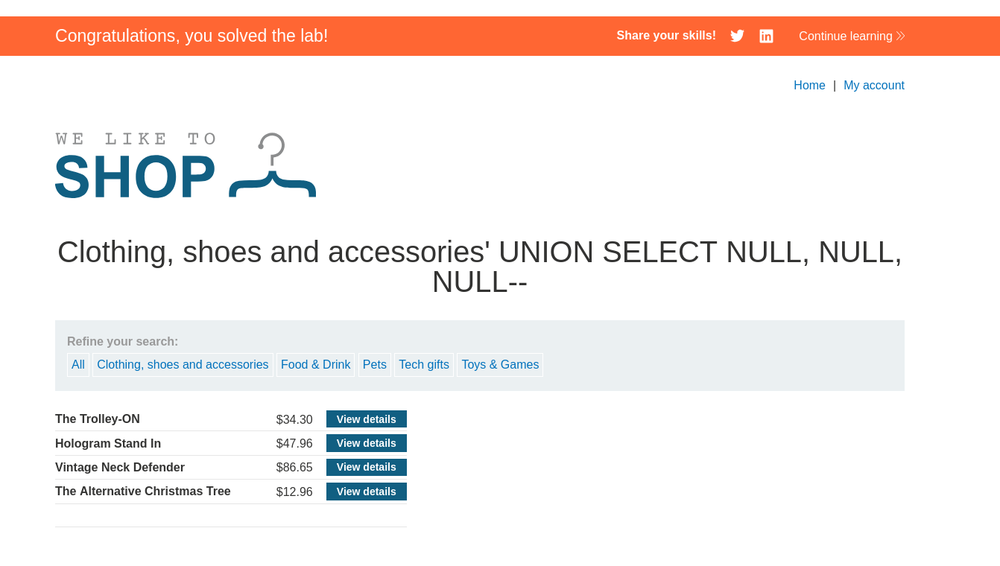

# 1.Резюме
Задание, похоже на предыдущие лабы 5 и 6. Только здесь облегчение, нужно просто понять количество столбцов при объёдинении запроса через `UNION`. 

В ходе тестирования веб-приложения `https://lab-target.web-security-academy.net` была обнаружена **SQL-инъекция (SQLi)** в фильтре категорий товаров.

**Тип уязвимости**: Некорректная конкатенация пользовательского ввода в SQL-запрос.

**Воздействие**: Злоумышленник может модифицировать логику запроса и получить данные, которые не должны отображаться(включая логин и пароль администратора).

**Результат**: По условию задания с помощью `UNION SELECT` нужно получить пароль администратора и войти под соответствующей УЗ.

# 2.Решение поставленной задачи

Мы знаем, что уязвимым является фильтр запроса, для того, чтобы понять, сколько столбцов возвращается запросом, можно воспользоваться теми техниками, которые предлагает сам Burp Suite, а именно перебор `ORDER BY N` или `SELECT N*NULL`. Я решил воспользоваться вторым способом и просто перебирать количество `NULL` стобцов. В итоге оказалось, что столбцов с левом запросе 3 и итоговый url: `https://lab-target.web-security-academy.net/filter?category=Accessories' UNION SELECT NULL, NULL, NULL--`
*Рисунок 1 - определяем количество стобцов*

# 3.Выводы
- Уязвимость найдена в параметре category приложения.
- **Вектор атаки:** изменение логики sql запроса с помощью `UNION`.
- **Последствия:** получение кредов администратора.

Лабораторная работа **выполнена**. Уязвимость подтверждена, скрытые данные извлечены.

