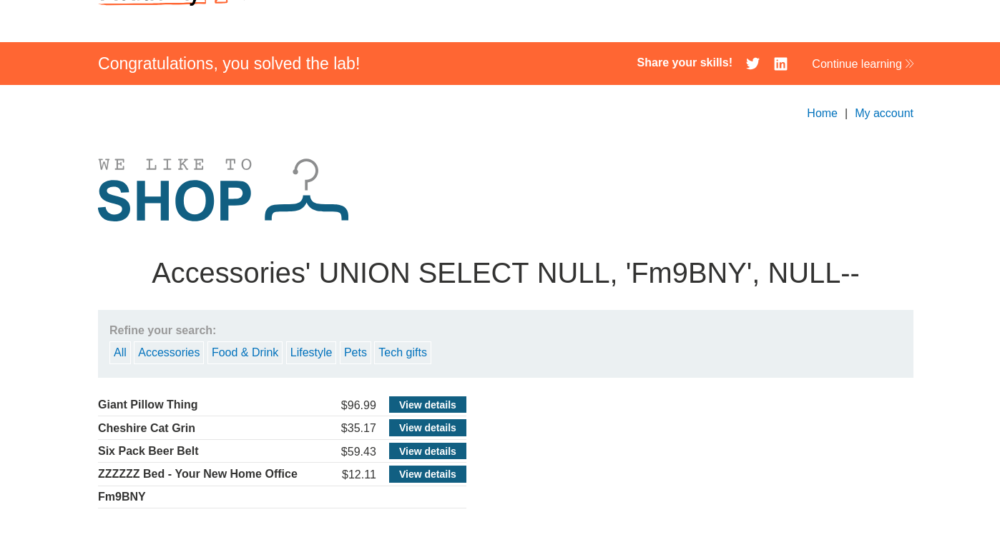

# 1.Резюме
По сути продолжение 7 лабораторной. 

В ходе тестирования веб-приложения `https://lab-target.web-security-academy.net` была обнаружена **SQL-инъекция (SQLi)** в фильтре категорий товаров.

**Тип уязвимости**: Некорректная конкатенация пользовательского ввода в SQL-запрос.

**Воздействие**: Злоумышленник может модифицировать логику запроса и получить данные, которые не должны отображаться(включая логин и пароль администратора).

**Результат**: По условию задания с помощью `UNION SELECT` нужно получить пароль администратора и войти под соответствующей УЗ.

# 2.Выполнение задания
Вот мы узнали, что в запросе три столбца, теперь, нужно понять, может ли хотя бы один из них переводить данные в строковый формат. Почему строковый? Потому что считается, что важная информация, наподобие паролей храниться в этом типе данных. По заданию нужно, чтобы БД вернула определённую строку, в моём случае `Fm9BNY`. Будем подставлять даннуб строку на место одного из стобцов вместо `NULL` и если запрос будет успешным, значит данный столбец модет конвертировать данные в строковый формат. Оказалось, что второй столбец принимает строку, поэтому запрос итоговый выглядит: `https://lab-target.web-security-academy.net/filter?category=Accessories' ' UNION SELECT NULL, 'Fm9BNY', NULL--`.
*Рисунок 1 - Успешный запрос*

# 3.Выводы
- Уязвимость найдена в параметре category приложения.
- **Вектор атаки:** изменение логики sql запроса с помощью `UNION`.
- **Последствия:** получение кредов администратора.

Лабораторная работа **выполнена**. Уязвимость подтверждена, скрытые данные извлечены.
