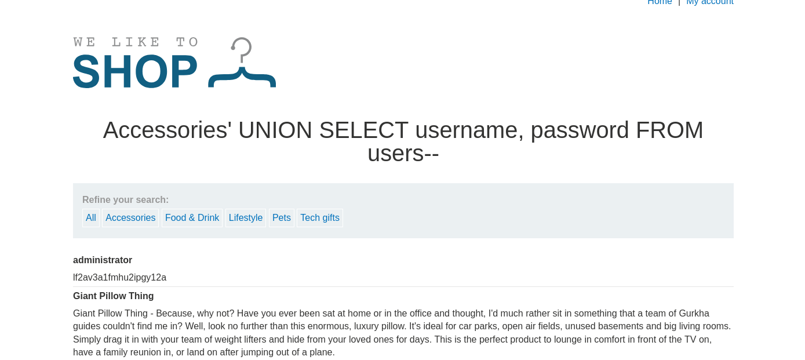

# 1.Резюме

В лабораторной 5 и 6 было тоже самое, но сложнее. Здесь нам уже дают название столбцов(`username`,`password`) и название таблицы(`users`). 

В ходе тестирования веб-приложения `https://lab-target.web-security-academy.net` была обнаружена **SQL-инъекция (SQLi)** в фильтре категорий товаров.

**Тип уязвимости**: Некорректная конкатенация пользовательского ввода в SQL-запрос.

**Воздействие**: Злоумышленник может модифицировать логику запроса и получить данные, которые не должны отображаться(включая логин и пароль администратора).

**Результат**: По условию задания с помощью `UNION SELECT` нужно получить пароль администратора и войти под соответствующей УЗ.

# 2.Решение задания
Всё, что нам нужно сделать объёдинить запрос с помощью `UNION`. В итоге: `https://lab-target.web-security-academy.net/filter?category=Accessories' ' UNION SELECT username, password FROM users--`. 
*Рисунок 1 - читает значения столбцов таблицы users*

В итоге получаем пароль админа и успешно логинимся.
*Рисунок 2 - успешный заход администратора*

# 3.Выводы
- Уязвимость найдена в параметре category приложения.
- **Вектор атаки:** изменение логики sql запроса с помощью `UNION`.
- **Последствия:** получение кредов администратора.

Лабораторная работа **выполнена**. Уязвимость подтверждена, скрытые данные извлечены.
